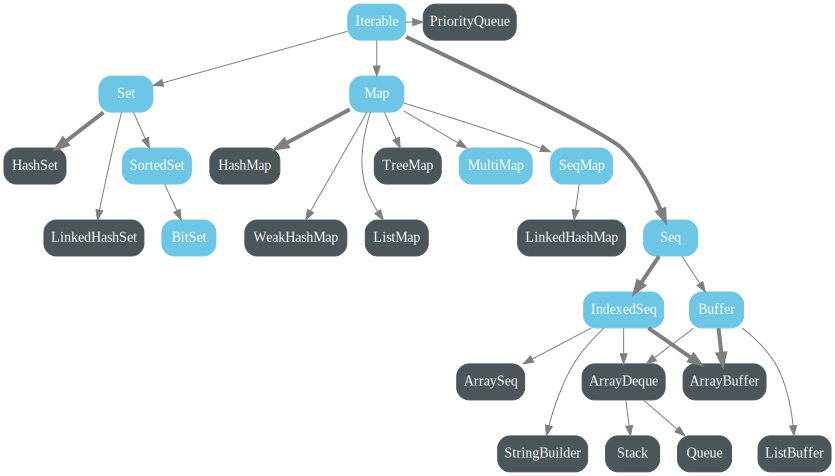

# Scala Collection

---

## Справка

```scala
(1, 2, 3)
// res0: (Int, Int, Int) = (1, 2, 3)
1 -> 2 -> 3
// res1: ((Int, Int), Int) = ((1, 2), 3)
("a", 1, 0.5)
// res2: (String, Int, Double) = ("a", 1, 0.5)


val f: Int => String = i => i.toString()
// f: Int => String = <function1>
val f2: Int => String = _.toString()
// f2: Int => String = <function1>


val fTwo: (Int, Int) => Int = (i1, i2) => i1 + i2
// fTwo: (Int, Int) => Int = <function2>
val fTwo2: (Int, Int) => Int = _ + _
// fTwo2: (Int, Int) => Int = <function2>
```

---

## Коллекции

- Option;
- множества (sets); 
- отображения (maps);
- последовательности (sequences). 

---

## Мутабельность

По умолчанию используются иммутабельные (неизменяемые) коллекции.

```scala
val l = List(1, 2, 3)
//l += 4  // value += is not a member of List[Int]
//l(0) = 4000  // value update is not a member of List[Int]

val l2 = collection.mutable.MutableList(1, 2, 3) 
// MutableList(1000, 2, 3, 4)
l2 += 4
l2(0) = 1000

val a = Array(1, 2, 3) // Array(1000, 2, 3)
//a += 4  // value += is not a member of Array[Int]
a(0) = 1000
```

---

### scala.collection.immutable


---

### scala.collection.mutable



---

## Option

- Располагается в пакете `scala`, а не вместе с коллекциями: `scala.Option`;
- Может содержать ноль (`None`) или один (`Some`) элемент.

```scala
val some: Option[Int] = Some(1)
// some: Option[Int] = Some(1)

val none: Option[Int] = None
// none: Option[Int] = None
```

---

## Списки: List


---

### Списки: List

- Однородны;
  - `List[String]` не может содержать `Int`;
- ковариантны;
  - если `T` подтип `S`, то и `List[T]` подтип `List[S]`.

```scala
sealed trait Animal
case class Cat() extends Animal
case class Dog() extends Animal

val l: List[Animal] = List(Cat(), Cat(), Cat())
```

---

### List: Создание 1

```scala
val list0 = List() 
// list0: List[Nothing] = List()

val list1 = List(1, 2, 3) 
// list1: List[Int] = List(1, 2, 3)

val list2 = List.range(1,5) 
// list2: List[Int] = List(1, 2, 3, 4)
val list2a = List.range(1, 5, 2) 
// list2a: List[Int] = List(1, 3)

val list3 = List.fill(5)("t") 
// list3: List[String] = List("t", "t", "t", "t", "t")

val list4 = List.tabulate(5)(n => n/2.0) 
// list4: List[Double] = List(0.0, 0.5, 1.0, 1.5, 2.0)
```

---

### List: Создание 2

`Nil` - пустой список.

```scala
val empty = Nil 
// empty: Nil.type = List()

val list = 3 :: 2 :: 1 :: Nil 
// list: List[Int] = List(3, 2, 1)

val d = Nil 
// d: Nil.type = List()
val c = 3 :: d 
// c: List[Int] = List(3)
val b = 2 :: c 
// b: List[Int] = List(2, 3)
val a = 1 :: b 
// a: List[Int] = List(1, 2, 3)
```

---

### List: Шаблоны

```scala
val List(a, b, c) = List(1, 2, 3)
// a: Int = 1
// b: Int = 2
// c: Int = 3

val x :: y :: z = List(1, 2, 3)
// x: Int = 1
// y: Int = 2
// z: List[Int] = List(3)

val m :: n :: k = List(1, 2, 3, 4, 5)
// m: Int = 1
// n: Int = 2
// k: List[Int] = List(3, 4, 5)


//val m :: n :: Nil = List(1, 2, 4)  // scala.MatchError
```

---

### Пример

```scala
List(1,2,3) match {
  case x => "one"
  case x :: y => "two"
  case x :: y :: z => "three"
}
// res0: String = ???
```

---

```scala

List(1,2,3,4,5) match {
  case x :: y :: z => "three"
  case x :: y => "two"
  case x => "one"
}
// res1: String = "three"


List(1,2,3) match {
  case x :: Nil => "one"
  case x :: y :: Nil => "two"
  case x :: y :: z :: Nil => "three"
}
// : String = "three"
```

---

## Методы первого порядка

---

### Length, indices

```scala
val len1 = List(1, 2, 3).length
//len1: Int = 3

val len2 = List().length 
//len2: Int = 0

val len3 = Nil.length 
//len3: Int = 0

val idx1 = List(1, 2, 3).indices 
//idx1: Range = Range(0, 1, 2)

val idx2 = Nil.indices 
//idx2: Range = Range()


```

---

### Head, tail, isEmpty 

```scala
val head = List(1, 2, 3).head 
//head: Int = 1

List(1, 2, 3).headOption
// res5: Option[Int] = Some(1)

val tail = List(1, 2, 3, 4, 5).tail 
//tail: List[Int] = List(2, 3, 4, 5)

val isEmpty = List(1, 2, 3, 4, 5).isEmpty 
//isEmpty: Boolean = false

val isEmptyNil = Nil.isEmpty 
//isEmptyNil: Boolean = true
```

---

### Contains, Distinct

```scala
List(1, 2, 3).contains(3) 
// Boolean = true

List(1, 2, 3).contains(0) 
// Boolean = false

List(1,2,2,3,3,3).distinct
// res2: List[Int] = List(1, 2, 3)

case class Cat(name: String)
List(Cat("Sam"), Cat("Nyan"), Cat("Nyan")).distinct
// List(Cat("Sam"), Cat("Nyan"))

class SimpleCat(name: String)
(new SimpleCat("Nyan") :: new SimpleCat("Nyan") :: Nil)
  .distinct.length
// 2

```

---

### Last, init

```scala
val abcde = List('a', 'b', 'c', 'd', 'e') 
//abcde: List[Char] = List('a', 'b', 'c', 'd', 'e')

val last1 = abcde.last 
//last1: Char = 'e'

val init1 = abcde.init 
//init1: List[Char] = List('a', 'b', 'c', 'd')

List().init 
//java.lang.UnsupportedOperationException: init of empty list
//  scala.collection.immutable.Nil$.init(List.scala:596)
//  ...

List().last 
//java.util.NoSuchElementException: last of empty list
//  scala.collection.immutable.Nil$.last(List.scala:595)
//  ...
```

---

### Reverse

```scala
val edcba = List("e", "d", "c", "b", "a") 
//edcba: List[String] = List("e", "d", "c", "b", "a")

val reverse1 = edcba.reverse 
//reverse1: List[String] = List("a", "b", "c", "d", "e")
```

---

### Drop, take, splitat

```scala

val abcde = List('a', 'b', 'c', 'd', 'e') 

val teke1 = abcde.take(2) 
//teke1: List[Char] = List('a', 'b')

val drop1 = abcde.drop(2) 
//drop1: List[Char] = List('c', 'd', 'e')

val splitat1 = abcde.splitAt(2) 
//(List('a', 'b'), List('c', 'd', 'e'))

```

---

### Flatten

```scala

List(List(1, 2), List(3), List(), List(4,5)).flatten 
//List[Int] = List(1, 2, 3, 4, 5)

val flatten2 = List(1, 2, 3).flatten 
//No implicit view available from Int => IterableOnce[B]
//val flatten2 = List(1, 2, 3).flatten                                                                                                                  

List(  List(List(), List(1))  ,  List(List(2)) ).flatten 
//List[List[Int]] = List(List(), List(1), List(2))

List(Some(1), Some(2), None).flatten
// : List[Int] = List(1, 2)

```

---

### Zip и Unzip

```scala

val abcde = List('a', 'b', 'c', 'd', 'e') 

val zip1 = abcde.indices.zip(abcde) 
//  Vector((0, 'a'), (1, 'b'), (2, 'c'), (3, 'd'), (4, 'e'))

val zip2 = abcde.zip(List(1, 2, 3)) 
// List(('a', 1), ('b', 2), ('c', 3))

val zipIdx = abcde.zipWithIndex 
// List(('a', 0), ('b', 1), ('c', 2), ('d', 3), ('e', 4))

val unzip = zip2.unzip 
// (List('a', 'b', 'c'), List(1, 2, 3))

```

---

### Добавление элемента

List - плохой выбор для частой вставки в конец.

```scala
3 :: List(1,2)
// res3: List[Int] = List(3, 1, 2)

//List(1, 2) :: 3 // value :: is not a member of Int

List(1, 2) :+ 3
// res4: List[Int] = List(1, 2, 3)
3 +: List(1, 2)
// res5: List[Int] = List(3, 1, 2)

```

---

### Объединение списков

```scala
// Операция только для листов

val `2list1` = List(1, 2) ::: List(3, 4, 5) 
//`2list1`: List[Int] = List(1, 2, 3, 4, 5)

val `2list2`= List() ::: List(1, 2, 3) 
//`2list2`: List[Int] = List(1, 2, 3)

val `2list3` = Nil  ::: List(1, 2, 3) 
//`2list3`: List[Int] = List(1, 2, 3)

// Операция для любых коллекций

List(1, 2, 3) ++ List(4, 5)
// res5: List[Int] = List(1, 2, 3, 4, 5)
List(1,2) ++ Some(3)
// res8: List[Int] = List(1, 2, 3)
List(1,2) ++ None
// res9: List[Int] = List(1, 2)
```

---

### toString, mkString

```scala

val abcde = List('a', 'b', 'c', 'd', 'e') 
val abcStr = abcde.toString 
//abcStr: String = "List(a, b, c, d, e)"

val list = List(1, 2, 3, 4, 5)
val lstStr = list.toString 
//lstStr: String = "List(1, 2, 3, 4, 5)"

val str1 = abcde.mkString ("[", ",", "]") 
//str1: String = "[a,b,c,d,e]"

val str3 = abcde.mkString (",") 
//str3: String = "a,b,c,d,e"

//val str4 = abcde.mkString (",", "]") 
```

---

## Методы высшего порядка

---

### Map, foreach

```scala
List(1,2,3).map(_.toString())
// res0: List[String] = List("1", "2", "3")

List(1,2,3).foreach(_.toString()) // ()
List(1,2,3).foreach(println)
// 1
// 2
// 3
```

---

### FlatMap

```scala
val listOpt = List(1,2,3).map(Some(_))
// listOpt: List[Some[Int]] = List(Some(1), Some(2), Some(3))
listOpt.flatten
// res3: List[Int] = List(1, 2, 3)

List(1,2,3).flatMap(Some(_))
// res4: List[Int] = List(1, 2, 3)
```

---

### map, flatmap

```scala
val li = 3 :: 2 :: 1 :: Nil
val filterOpt: Int => Option[Int] = x => if (x % 2 == 0) Some(x) else None

for {
    item <- li
    itemPlus = item + 1
    itemAfterOpt <- filterOpt(itemPlus)
} yield itemAfterOpt
// List(4, 2)
```

```scala
li.map { item => val itemPlus = item + 1; (item, itemPlus) }
    .flatMap { case (item, itemPlus) =>
        filterOpt(itemPlus)
            .map(itemAfterOpt => itemAfterOpt)
    }
```

---

### Filter, Partition

```scala
val filter1 = List(1, 2, 3, 4, 5).filter(_ % 2 == 0) 
//filter1: List[Int] = List(2, 4)

val filter2 = List(1, 2, 3, 4, 5).filter(_ < 0)  
/filter2: List[Int] = List()

val partition1 = List(1, 2, 3, 4, 5).partition(_ % 2 == 0) 
//(List[Int], List[Int]) = (List(2, 4), List(1, 3, 5))

val partition2 = List(1, 2, 3, 4, 5).partition(_ < 0) 
//(List[Int], List[Int]) = (List(), List(1, 2, 3, 4, 5))
```

---

### Find

```scala
val find1 = List(1, 2, 3, 4, 5).find(_ % 2 == 0) 
//find1: Option[Int] = Some(2)

val find2 = List(1, 2, 3, 4, 5).find(_ <= 0) 
//find2: Option[Int] = None
```

---

### GroupBy

```scala
List(Cat("Sam"), Cat("Nyan"), Cat("Nyan")).groupBy(_.name)
//HashMap(
//     "Sam" -> List(Cat("Sam")), 
//     "Nyan" -> List(Cat("Nyan"), Cat("Nyan")
//)
)
```

---

### DistinctBy

```scala

List(Cat("Sam"), Cat("Nyan"), Cat("Nyan")).groupBy(_.name)
//HashMap(
//     "Sam" -> List(Cat("Sam")), 
//     "Nyan" -> List(Cat("Nyan"), Cat("Nyan")
//)

List(Cat("Sam"), Cat("Nyan"), Cat("Nyan"))
  .groupBy(_.name)
  .flatMap(_._2.headOption)
// List(Cat(name = "Sam"), Cat(name = "Nyan"))

List(Cat("Sam"), Cat("Nyan"), Cat("Nyan")).distinctBy(_.name)
// List(Cat(name = "Sam"), Cat(name = "Nyan"))

```


---


### TakeWhile, DropWhile

```scala
val takeWhile1 = List(1, 2, 3, -4, 5).takeWhile(_ > 0)  
//takeWhile1: List[Int] = List(1, 2, 3)

val dropWhile1 = List("banana", "pear", "apple", "orange")
        .dropWhile(_.startsWith("b")) 
//dropWhile2: List[String] = List("pear", "apple", "orange")
```

---

### Span

```scala
val lst = List(1, 2, 3, -4, 5)
val span1 = lst.span(_ > 0) 
//span1: (List[Int], List[Int]) = (List(1, 2, 3), List(-4, 5))

val span2 = (lst.takeWhile(_ > 0), lst.dropWhile(_ > 0)  ) 
//span2: (List[Int], List[Int]) = (List(1, 2, 3), List(-4, 5))
```

---

### ForAll, Exist

```scala
val forall1 = List(1, 2, 3).forall( _ > 0) 
//forall1: Boolean = true

val forall2 = List(1, 2,-3).forall( _ > 0) 
//forall2: Boolean = false

val exists1 = List(1, 2,-3).exists( _ < 0) 
//exists1: Boolean = true

val exists2 = List(1, 2, 3).exists( _ < 0) 
//exists2: Boolean = false

```

---

### FoldLeft, FoldRight

```scala
val num = List(1, 2, 3)
val foldLeft1 = num.foldLeft(0)(_ + _) 
//foldLeft1: Int = 6

val foldLeft2 = num.foldLeft(-6)(_ + _) 
//foldLeft2: Int = 0

val foldRight1 = num.foldRight(0)(_ + _) 
//foldRight1: Int = 6

val foldRight2 = num.foldRight(-6)(_ + _) 
//foldRight2: Int = 0
```

---

### FoldLeft, FoldRight


---

### Нагляднее

```scala

val lst = List("a", "b", "c", "d")

val foldLeft1 = lst.foldLeft("z")(_ + _)  
//foldLeft1: String = "zabcd"
//op(op(op(z, a), b), c) 

val foldRight1 = lst.foldRight("z")(_ + _)  
//foldRight1: String = "abcdz"
//op(a, op(b, op(c, z)))

val foldLeft2 = lst.tail.foldLeft(lst.head)(_ + " " + _) 
//foldLeft2: String = "a b c d"

val foldRight2 = lst.tail.foldRight(lst.head)(_ + " " + _) 
//foldRight2: String = "b c d a"

```

---

### Fold

```scala
val lst = List("a", "b", "c", "d")
// lst: List[String] = List("a", "b", "c", "d")

val foldLeft1 = lst.foldLeft("z")(_ + _)  
// foldLeft1: String = "zabcd"
val fold = lst.fold("z")(_ + _)
// fold: String = "zabcd"

List(1,2,3).fold("")(_ + _.toString())
// res5: Any = "123"

val opt: Option[Int] = None
// opt: Option[Int] = None
opt.fold(0)(_ + 42)
// res6: Int = 0
opt.map(_ + 42).getOrElse(0)
```

---

### ReduceLeft, reduceRight

```scala

val num = List(1, 2, 3)
val reduceLeft1 = lst.reduceLeft(_ + _) 
//reduceLeft1: Int = 6

val reduceLeft2 = num.reduceLeft(_ min _) 
//reduceLeft2: Int = 1

val reduceRight1 = num.reduceRight(_ + _) 
//reduceRight1: Int = 6

val reduceRight2 = num.reduceRight(_ max _) 
//reduceRight2: Int = 3
```

---

### Reduce vs fold

```scala

val emptyLst = List.empty[String]

val foldLeftEmpty = emptyLst.foldLeft("i")(_ + _) 
//foldLeftEmpty: String = "i"

List.empty[Int].reduceLeft(_ + _)
//UnsupportedOperationException: empty.reduceLeft

List.empty[Int].reduceLeftOption(_ + _)
// : Option[Int] = None
```

---

### Sorted

```scala
val a = List(10, 5, 8, 1, 7).sorted
//sort4: List[Int] = List(1, 5, 7, 8, 10)

case class Cat (name: String, age: Int)

val s = List(Cat("Мурзик", 2), Cat("Murka", 1)).sorted
//  error: No implicit Ordering defined for Cat.
```

---

### SortWith

```scala
List(4, 1, 5, 2, 3).sortWith(_ > _)
// res9: List[Int] = List(5, 4, 3, 2, 1)

case class Cat(name: String, age: Int)

val s = List(Cat("Мурзик", 2), Cat("Murka", 1))
// s: List[Cat] = List(Cat("Мурзик", 2), Cat("Murka", 1))

s.sortWith(_.name < _.name)
// res10: List[Cat] = List(Cat("Murka", 1), Cat("Мурзик", 2))
```

---

### Определение Ordering

```scala
case class Cat(name: String, age: Int)

object Cat {

  implicit val ordering = new Ordering[Cat] {

    override def compare(`this`: Cat, that: Cat): Int =
      if (`this`.name == that.name)
        0
      else if(`this`.name > that.name)
        1
      else -1
    }
}

val s = List(Cat("Мурзик", 2), Cat("Murka", 1)).sorted
// s: List[Cat] = List(Cat("Murka", 1), Cat("Мурзик", 2))
```

---

### Представления

Представление - это базовая коллекция, для которой все трансформеры выполняются ленивым образом.

```scala
List(1, 2, 3)
  .map(_ * 2) // List(2, 4, 6)
  .map(_ + 3) // List(5, 7, 9)

List(1, 2, 3).view
  .map(_ * 2)
  .map(_ + 3)
  .toList // List(5, 7, 9)
```

---

## Другие коллекции

---

### Vector


eC - effictively constant time - время не константно, но настолько близко к нему, что разницей можно пренебречь.

---

### Array


```scala
val arr1 = new Array[Int](5) 
//arr1: Array[Int] = Array(0, 0, 0, 0, 0)

val arr2 = Array(5, 4, 3, 2, 1) 
//arr2: Array[Int] = Array(5, 4, 3, 2, 1)

val arr3 = Array(5) 
//arr3: Array[Int] = Array(5)
```

---

### Set

Множество уникальных значений.

```scala
val str = "Беги Лола, беги!" 
//str: String = "Беги Лола, беги!"

val split = str.toLowerCase.split("[ !,]+") 
//split: Array[String] = Array("беги", "лола", "беги")

var set = collection.mutable.Set.empty[String] 
//set: collection.mutable.Set[String] = HashSet()

for (word <- split)
    set += word 
//set: Set[String] = HashSet("беги", "лола")
```

---

### Map

Множество уникальных отображений.

```scala
val map1 = Map(
  "one" -> 1,
  "two" -> 2
) 
//map1: Map[String, Int] = Map("one" -> 1, "two" -> 2)

val map2 = Map(
  "one" -> 1,
  "two" -> 3,
  "three" -> 3,
  "two" -> 2
) 
//Map("one" -> 1, "two" -> 2, "three" -> 3)
```

---

### TreeMap, HashMap

```scala
import scala.collection.immutable.HashMap
import scala.collection.immutable.TreeMap

val sMap = HashMap(3 -> 'c', 4 -> 'd', 1 -> 'a', 2 -> 'b')
// Хэш-таблица

val tMap = TreeMap(3 -> 'c', 4 -> 'd', 1 -> 'a', 2 -> 'b')
// Красно-чёрное дерево
```

---


---

### Равенство коллекций

При сравнении коллекции Scala деляется на группы: 

- Множества (sets); 
- Отображения (maps);
- Последовательности (sequences). 

---

Коллекции из разных групп не могут быть равны:

```scala
Set(1, 2, 3) == List(1, 2, 3)
// res0: Boolean = false
List((1 -> "a"), (2 -> "b")) == Map(1 -> "a", 2 -> "b")
// res1: Boolean = false
```

---

Коллекции из одной группы могут быть равны независимо от мутабельности:

```scala
List(1,2,3) == Vector(1,2,3)
// res2: Boolean = true
Set(1,2,3) == Set(3,1,2)
// res3: Boolean = true
Set(1, 2, 3) == scala.collection.mutable.Set(1, 2, 3)
// res4: Boolean = true
List(1, 2, 3) == scala.collection.mutable.MutableList(1, 2, 3)
// res5: Boolean = true
```

---

### Равенство Array

```scala
import scala.collection.mutable.ArraySeq

Array(1, 2, 3) == List(1, 2, 3)
// res6: Boolean = false
Array(1, 2, 3) == Vector(1, 2, 3)
// res7: Boolean = false
Array(1, 2, 3) == Set(1, 2, 3)
// res8: Boolean = false
Array() == Map()
// res9: Boolean = false

Array(1,2,3) == Array(1,2,3)
// res10: Boolean = false

Array(1, 2, 3) == ArraySeq(1,2,3)
// res11: Boolean = false
ArraySeq(1,2,3) == Vector(1,2,3)
// res12: Boolean = true

Array(1,2,3).sameElements(List(1,2,3))
// res13: Boolean = true
```

---


## Совместимость коллекций Scala с Java

---

### Полная конвертируемость

```scala
Iterator               <=>     java.util.Iterator
Iterator               <=>     java.util.Enumeration
Iterable               <=>     java.lang.Iterable
Iterable               <=>     java.util.Collection

mutable.Buffer         <=>     java.util.List
mutable.Set            <=>     java.util.Set
mutable.Map            <=>     java.util.Map
mutable.ConcurrentMap  <=>     java.util.concurrent.ConcurrentMap
```

---

### Односторонняя конвертируемость

```scala
Seq           =>    java.util.List
mutable.Seq   =>    java.util.List
Set           =>    java.util.Set
Map           =>    java.util.Map
```

---

### Конвертеры

```scala
import scala.collection.JavaConverters._ 

val javaList = new java.util.ArrayList[Int](3)
// javaList: java.util.ArrayList[Int] = [1, 2]
javaList.add(1)
// res11: Boolean = true
javaList.add(2)
// res12: Boolean = true
javaCol.asScala
// res14: collection.mutable.Buffer[Int] = Buffer(1, 2)
javaList.asScala.toList
// res13: List[Int] = List(1, 2)
```

---

### Иммутабельность при конвертировании

```scala
import scala.collection.JavaConverters._ 

val javaCol = List(1,2,3).asJava
// javaCol: java.util.List[Int] = SeqWrapper(List(1, 2, 3))
javaCol.asScala
// res14: collection.mutable.Buffer[Int] = Buffer(1, 2, 3)
javaCol.asScala.toList
// res15: List[Int] = List(1, 2, 3)

javaCol.add(4) //java.lang.UnsupportedOperationException
```

---

```scala
import scala.collection.JavaConverters._ 

val javaList = new java.util.ArrayList[Int](3)
// javaList: java.util.ArrayList[Int] = [1, 2]
javaList.add(1)
// res0: Boolean = true
javaList.add(2)
// res1: Boolean = true

val scalaList = javaList.asScala.toList
// scalaList: List[Int] = List(1, 2)

//scalaList += 3
//scalaList(0) = 400
```

---

## Спасибо за внимание

- https://docs.scala-lang.org/overviews/collections-2.13/introduction.html